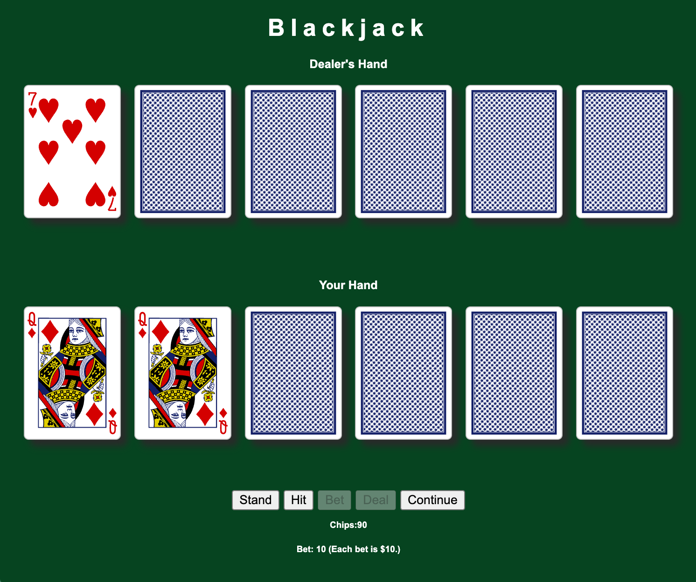
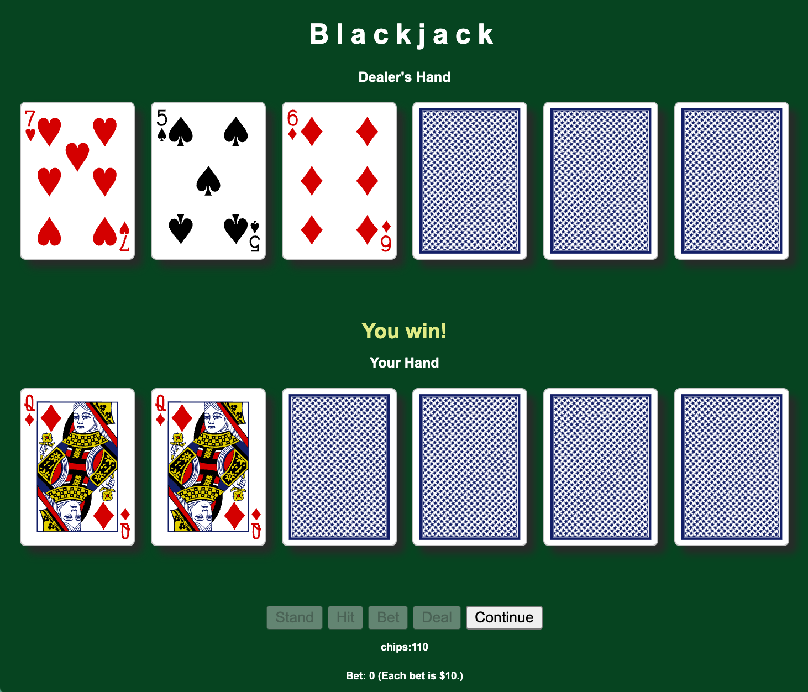

  

  

  # BLACKJACK

  ### [CLICK TO PlAY](https://emilyyejia.github.io/blackjack/)

## Description
Blackjack is a classic casino card game where players compete against the dealer to get a hand total closest to 21 without going over. You must decide when to "hit" for more cards or "stand" to keep your current hand, all while trying to beat the dealer's total.

## How to win
- You hit 21 with your first two cards (an Ace and a 10-value card) — this is a Blackjack, and usually wins instantly unless the dealer also has Blackjack.

- Your hand value is higher than the dealer’s without going over 21.

- The dealer busts (goes over 21) and your hand is 21 or less.

- You stand with a strong hand, and the dealer draws cards that total less than yours.

## Screenshot
| Screenshots| Description |
| ------ | ----------- |
| Player's turn |  |
| Dealer's turn |  |

## Technologies Used

 
 
 
 
 
 
 

## Getting Started

### Instructions

1. Press `bet` to place your wager ($10 per click).

2. Press `deal` to start the round — you'll get two cards, and the dealer gets one.

3. Use `hit` to draw more cards or STAND to end your turn.

4. A message will show if you win, lose, or push (tie).

5. Press `continue` to reset the board and start a new round with your current chips.

### Link

Deployed Link （https://emilyyejia.github.io/blackjack/）

## Upcoming Features

- [:x:] Add sound effects for actions like shuffling, dealing cards, and winning or losing a round.
- [:x:] Introduce difficulty levels for the dealer's AI, making the game more challenging with more strategic plays.

